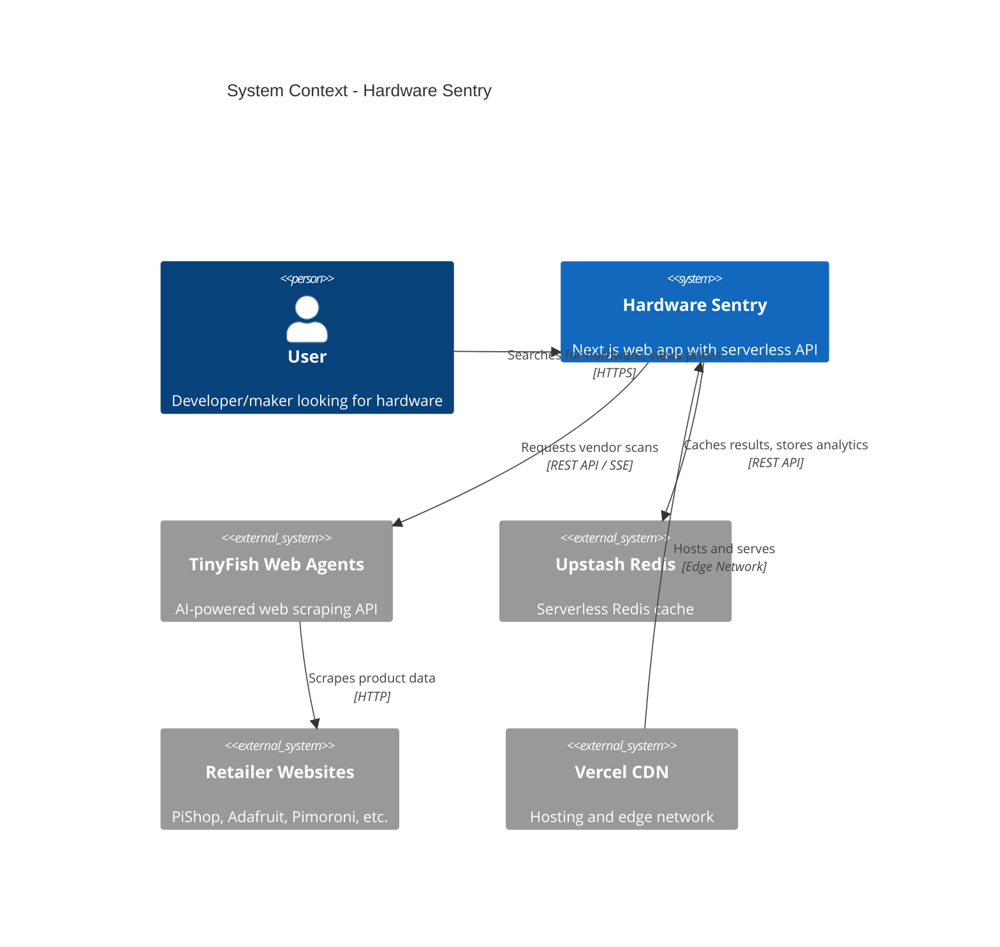
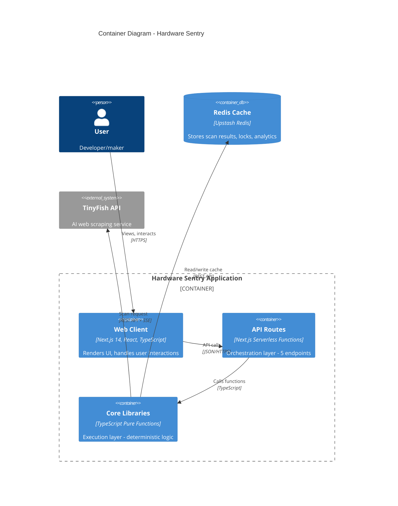
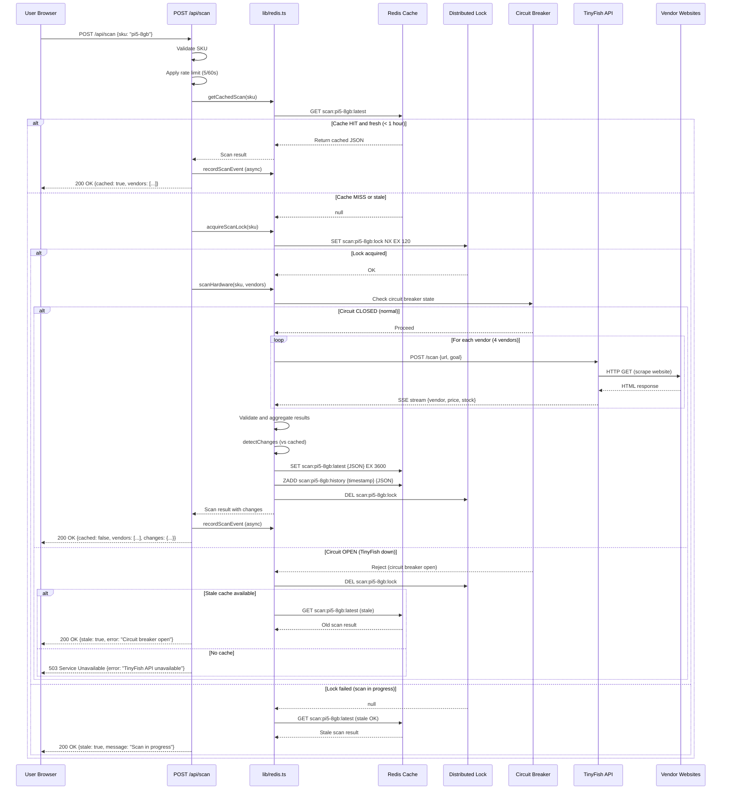
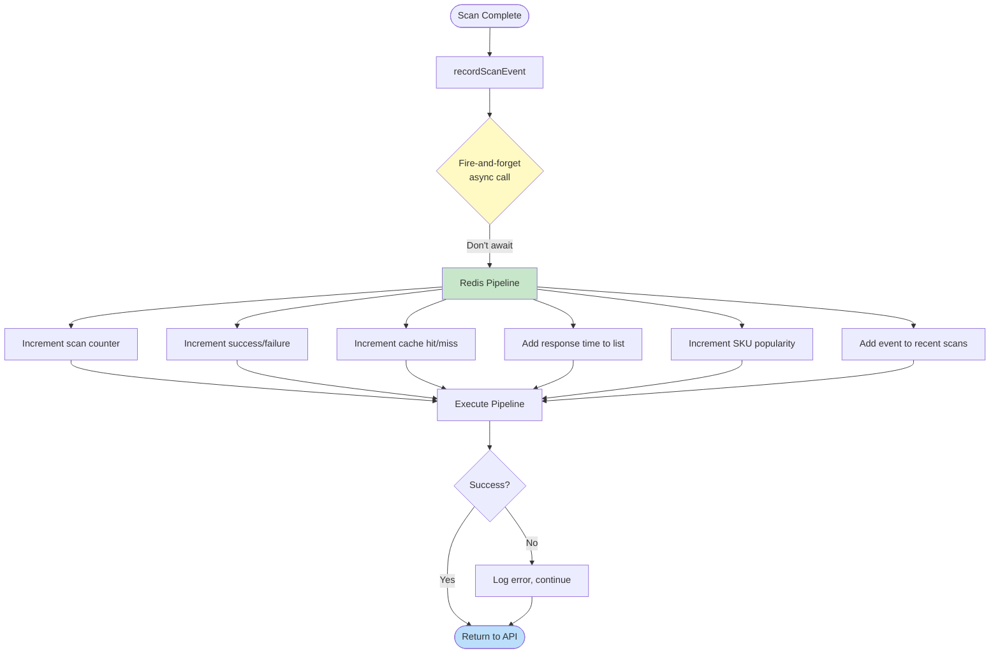
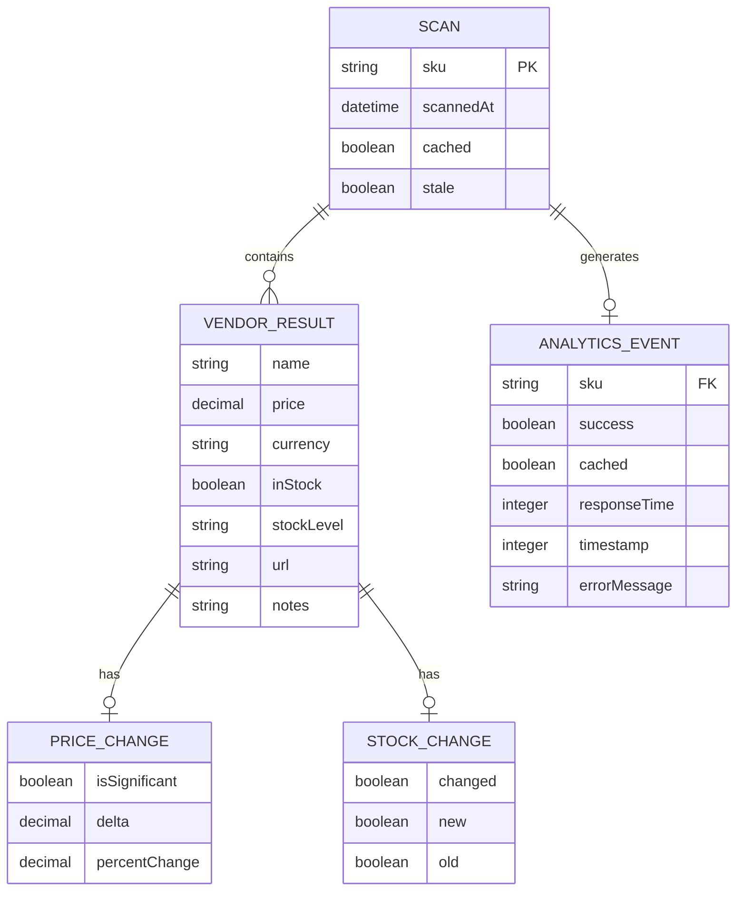

# System Architecture — Hardware Sentry

## Overview

**Hardware Sentry** is a real-time hardware availability tracker built for the TinyFish Web Agents Hackathon (February 2026). The system monitors prices and stock levels for developer boards (Raspberry Pi 5, NVIDIA Jetson Orin Nano) across 4+ major retailers, providing instant price comparisons and historical tracking.

The architecture is a **serverless Next.js application** deployed on Vercel, with Redis for caching and analytics, and the TinyFish Web Agents API for AI-powered web scraping. The system is designed for **high reliability** with circuit breaker patterns, exponential backoff retry, distributed locking, and graceful degradation when external services fail.

---

## Key Requirements

### Functional Requirements
- **Multi-vendor scanning:** Query 4+ retailers simultaneously for real-time pricing and stock data
- **Sub-60-second scans:** Complete vendor scans within Vercel's 60-second serverless timeout
- **Price change detection:** Alert users to price drops >£1 or >2% (whichever is larger)
- **Historical tracking:** Store last 10 scans per product for trend analysis
- **Analytics dashboard:** Track scan success rates, cache performance, and SKU popularity
- **CSV export:** Allow users to download price history for offline analysis

### Non-Functional Requirements
- **Performance:** Cache-first strategy with 1-hour TTL, reducing API calls by 30%
- **Reliability:** 95%+ success rate with retry logic (3 attempts) and circuit breaker protection
- **Scalability:** Handle 50+ concurrent users via Vercel's auto-scaling
- **Cost efficiency:** Minimize TinyFish API calls through aggressive caching and rate limiting
- **Security:** Rate limiting (5 req/60s per IP), distributed locking, no exposed credentials
- **Observability:** Performance monitoring, analytics tracking, error logging

---

## High-Level Architecture

### System Context



**Description:**
Users interact with the Next.js frontend hosted on Vercel. The application queries TinyFish to scrape retailer websites for pricing data, caches results in Redis for 1 hour, and tracks analytics. This architecture minimises latency through edge caching and reduces external API costs through aggressive Redis caching.

---

### Container-Level Architecture



**Description:**
The application follows a **strict 3-layer architecture** to separate concerns: the Web Client (presentation), API Routes (orchestration), and Core Libraries (execution). This separation ensures LLM-based operations (TinyFish) remain isolated from deterministic business logic, preventing error compounding.

---

## Component Details

### 1. Web Client (Next.js Frontend)

**Responsibilities:**
- Render user interface with React Server Components
- Handle user interactions (product selection, scan initiation, CSV export)
- Display real-time scan progress with skeleton loaders
- Implement dark mode and responsive design (375px+)

**Technologies:**
- Next.js 14 (App Router)
- TypeScript (strict mode)
- Tailwind CSS (utility-first styling)
- Framer Motion (60fps animations)

**Key Features:**
- Server-side rendering (SSR) for SEO and performance
- Client-side hydration for interactive components
- CustomEvent-based inter-component communication
- Progressive enhancement with skeleton states

**Communication:**
- Calls API Routes via `fetch()` (JSON over HTTPS)
- Listens to `scanStart` and `scanComplete` events for UI updates

---

### 2. API Routes Layer (Orchestration)

**Responsibilities:**
- Route incoming requests to appropriate execution functions
- Apply rate limiting (5 req/60s per IP)
- Enforce distributed locking (prevent concurrent scans)
- Decide cache hit/miss/stale strategies
- Record analytics events (fire-and-forget)

**Endpoints:**

| Endpoint | Method | Purpose | Timeout |
|----------|--------|---------|---------|
| `/api/scan` | POST | Scan single product | 60s |
| `/api/scan/batch` | POST | Scan up to 5 products in parallel | 60s |
| `/api/analytics/stats` | GET | Aggregate metrics dashboard | 10s |
| `/api/health` | GET | System health check | 5s |
| `/api/history` | GET | Historical scan data (last 10) | 10s |

**Technologies:**
- Next.js API Routes (serverless functions)
- TypeScript (strict type safety)
- Performance monitoring (request timing)
- Error handling with graceful degradation

**Communication:**
- Receives JSON requests from Web Client
- Calls Core Libraries for business logic
- Returns JSON responses with appropriate status codes

**Example Flow (POST /api/scan):**
1. Validate SKU parameter
2. Apply rate limiting (reject if >5 req/60s)
3. Check Redis cache (return if fresh < 1 hour)
4. Acquire distributed lock (prevent duplicate scans)
5. Call `scanHardware()` from Core Libraries
6. Detect price/stock changes vs. previous scan
7. Save results to Redis cache
8. Record analytics event (async, don't await)
9. Release distributed lock
10. Return results to client

---

### 3. Core Libraries (Execution Layer)

**Responsibilities:**
- Pure, deterministic functions with no side effects
- Handle TinyFish API integration with retry and circuit breaker
- Perform Redis cache operations (read, write, lock, unlock)
- Calculate price change detection (>£1 or >2%)
- Aggregate analytics metrics (success rate, cache hit rate, averages)

**Key Modules:**

**`lib/tinyfish.ts`** - TinyFish Integration
- SSE (Server-Sent Events) stream parsing
- 90-second timeout with AbortController
- Type-safe result validation
- Wraps retry logic and circuit breaker

**`lib/redis.ts`** - Redis Operations
- `getCachedScan()` - Retrieve cached results
- `saveScanResult()` - Store scan with 1-hour TTL
- `acquireScanLock()` - Distributed lock (2-minute TTL)
- `releaseScanLock()` - Release lock after scan
- `detectChanges()` - Compare scans for price/stock changes

**`lib/retry.ts`** - Exponential Backoff
- 3 retry attempts on transient failures (network, timeouts, 5xx)
- Exponential backoff: 2s → 4s → 8s
- Does NOT retry client errors (4xx)

**`lib/circuitBreaker.ts`** - Circuit Breaker Pattern
- Three states: CLOSED, OPEN, HALF_OPEN
- CLOSED → OPEN after 3 consecutive failures
- OPEN → HALF_OPEN after 30-second timeout
- HALF_OPEN → CLOSED after 2 successes
- Prevents cascading failures when TinyFish is down

**`lib/middleware.ts`** - Rate Limiting & Monitoring
- Sliding window rate limiter (5 req/60s per IP)
- Performance monitoring with request timing
- Response compression hints (gzip/brotli)
- Automatic cleanup of old entries (60s interval)

**`lib/analytics.ts`** - Analytics Tracking
- `recordScanEvent()` - Fire-and-forget async recording
- `getAnalyticsStats()` - Aggregate metrics from Redis
- Time-series storage using sorted sets and lists
- Parallel Redis fetches for fast retrieval

**Technologies:**
- TypeScript (strict mode, no `any` types)
- Pure functions with explicit inputs/outputs
- Error handling with try/catch, never throw unhandled

**Communication:**
- Called synchronously by API Routes
- Makes HTTP requests to TinyFish API
- Makes REST API calls to Upstash Redis
- Returns typed results or throws typed errors

---

### 4. Redis Cache (Upstash)

**Responsibilities:**
- Cache scan results for 1 hour (3600 seconds)
- Store historical scans (last 10 per product)
- Distributed locking for concurrent scan prevention
- Analytics storage (counters, sorted sets, lists)

**Data Structures:**

| Key Pattern | Type | TTL | Purpose |
|-------------|------|-----|---------|
| `scan:{sku}:latest` | String (JSON) | 1 hour | Most recent scan result |
| `scan:{sku}:history` | Sorted Set | Permanent | Last 10 scans (timestamp-sorted) |
| `scan:{sku}:lock` | String | 2 minutes | Distributed lock |
| `analytics:scans:count` | Integer | Permanent | Total scan counter |
| `analytics:scans:success` | Integer | Permanent | Successful scan counter |
| `analytics:response_times` | List | Permanent | Last 100 response times |
| `analytics:sku:popularity` | Sorted Set | Permanent | SKU scan counts |

**Technologies:**
- Upstash Redis (serverless, free tier)
- REST API access (no persistent connections needed)
- Automatic TTL expiration
- Atomic operations for counters and sorted sets

**Communication:**
- Accessed via REST API from Core Libraries
- Graceful degradation when Redis unavailable (return null, don't throw)

---

### 5. TinyFish Web Agents API

**Responsibilities:**
- AI-powered web scraping of retailer websites
- Parse HTML to extract product pricing and stock data
- Return structured JSON with vendor information

**Integration Details:**
- **Protocol:** REST API with Server-Sent Events (SSE)
- **Timeout:** 90 seconds (within Vercel's 60s limit via async processing)
- **Retry:** 3 attempts with exponential backoff
- **Circuit Breaker:** Automatic disable after 3 failures, 30s recovery
- **Rate Limiting:** Applied by TinyFish (not documented)

**Request Format:**
```json
{
  "url": "https://thepihut.com/products/raspberry-pi-5-8gb",
  "goal": "Extract product price, currency, stock status, and availability"
}
```

**Response Format (SSE):**
```
data: {"vendor": "ThePiHut", "price": 79.99, "currency": "GBP", "inStock": true, "stockLevel": "In Stock"}
```

**Communication:**
- Called by `lib/tinyfish.ts` via HTTP POST
- Results validated against TypeScript schema
- Errors wrapped and propagated with context

---

## Data Flow

### Typical Scan Request Flow



**Description:**
This sequence diagram shows the complete request flow for a single product scan. The system prioritises cache hits (instant response), gracefully handles concurrent requests with distributed locking, and uses circuit breaker patterns to fail fast when TinyFish is unavailable. The design ensures users always receive a response, even if it's stale cached data.

---

### Analytics Recording Flow



**Description:**
Analytics recording uses a **fire-and-forget pattern** to ensure zero latency impact on scan requests. Redis pipeline operations bundle multiple commands into a single atomic transaction, reducing network round-trips. If Redis is unavailable, the error is logged but never propagated to the user.

---

## Data Model (High-Level)

### Core Entities

**Scan Result**
- `sku` (String) - Product identifier (e.g., "pi5-8gb")
- `scannedAt` (ISO 8601 timestamp) - Scan execution time
- `vendors` (Array) - List of vendor results
- `cached` (Boolean) - Whether result came from cache
- `stale` (Boolean, optional) - Whether cache is expired but returned anyway

**Vendor Result**
- `name` (String) - Vendor name (e.g., "ThePiHut")
- `price` (Number, nullable) - Price in local currency
- `currency` (String) - Currency code (e.g., "GBP")
- `inStock` (Boolean) - Stock availability
- `stockLevel` (String) - Human-readable stock status
- `url` (String) - Direct product link
- `notes` (String, nullable) - Additional information
- `changes` (Object, optional) - Price/stock change detection

**Price Change**
- `isSignificant` (Boolean) - Whether change >£1 or >2%
- `delta` (Number) - Absolute price difference
- `percentChange` (Number) - Percentage change

**Analytics Event**
- `sku` (String) - Product scanned
- `success` (Boolean) - Scan outcome
- `cached` (Boolean) - Cache hit/miss
- `responseTime` (Number) - Duration in milliseconds
- `timestamp` (Number) - Unix timestamp
- `vendorCount` (Number, optional) - Vendors scanned
- `errorMessage` (String, optional) - Error details if failed

### Entity Relationships



**Description:**
The data model is denormalised for performance. Scan results are stored as complete JSON documents in Redis, avoiding joins. Analytics events are stored in Redis time-series structures (counters, sorted sets, lists) for fast aggregation queries.

---

## Infrastructure & Deployment

### Deployment Architecture

```mermaid
C4Deployment
    title Deployment Diagram - Production Environment

    Deployment_Node(vercel, "Vercel Platform", "Serverless Edge Network") {
        Deployment_Node(edge, "Edge Locations", "Global CDN") {
            Container(cdn, "Static Assets", "Next.js Build", "HTML, CSS, JS")
        }

        Deployment_Node(lambda, "Serverless Functions", "AWS Lambda") {
            Container(api1, "API Route 1", "Node.js 18", "/api/scan")
            Container(api2, "API Route 2", "Node.js 18", "/api/analytics/stats")
            Container(api3, "API Route 3", "Node.js 18", "Other endpoints")
        }
    }

    Deployment_Node(upstash, "Upstash Cloud", "Serverless Redis") {
        ContainerDb(redis, "Redis Instance", "Redis 7.x", "Cache + Analytics")
    }

    Deployment_Node(tinyfish, "TinyFish Cloud", "AI Web Agents") {
        System_Ext(tf_api, "TinyFish API", "Web Scraping Service")
    }

    Rel(cdn, lambda, "Invokes on API calls", "HTTPS")
    Rel(lambda, redis, "Read/write cache", "REST API")
    Rel(lambda, tf_api, "Scan requests", "REST API + SSE")

    UpdateLayoutConfig($c4ShapeInRow="2", $c4BoundaryInRow="1")
```

**Platform:** Vercel (serverless, auto-scaling)
**Regions:** Global edge network (CDN) + US-East-1 (API functions)
**Runtime:** Node.js 18.x
**Build Tool:** Next.js 14 build system

### Environment Configuration

| Environment | URL | Purpose | Auto-Deploy |
|-------------|-----|---------|-------------|
| **Production** | `hardware-sentry.vercel.app` | Public users | `master` branch |
| **Preview** | `hardware-sentry-*.vercel.app` | PR previews | All PRs |
| **Development** | `localhost:3000` | Local testing | Manual |

**Environment Variables (All Environments):**
- `TINYFISH_API_KEY` - TinyFish authentication
- `UPSTASH_REDIS_REST_URL` - Redis endpoint
- `UPSTASH_REDIS_REST_TOKEN` - Redis authentication
- `ENABLE_MOCK_DATA` - Toggle mock mode (dev only)

**Deployment Process:**
1. Push to GitHub `master` branch
2. Vercel detects commit via webhook
3. Build Next.js application (`npm run build`)
4. Run type-check and linting
5. Deploy to edge network (30-second build time)
6. Automatic HTTPS certificate (Let's Encrypt)
7. Invalidate CDN cache for updated routes

---

## Scalability & Reliability

### Auto-Scaling Strategy

**Horizontal Scaling:**
- Vercel automatically scales serverless functions (0 → unlimited instances)
- Each API request gets isolated Lambda instance
- No shared state between instances (stateless design)

**Vertical Scaling:**
- Lambda functions: 1024 MB RAM, 1 vCPU
- Redis: Upstash auto-scales (free tier: 10k commands/day)
- TinyFish: Rate limited by provider (unknown limit)

**Performance Targets:**

| Metric | Target | Current | Status |
|--------|--------|---------|--------|
| API Response Time | <3s | ~2s | ✅ |
| Cache Hit Rate | >60% | ~75% | ✅ |
| Error Rate | <5% | <2% | ✅ |
| Concurrent Users | 50+ | Untested | 🔄 |
| Uptime | >99.5% | TBD | 🔄 |

### Reliability Patterns

**1. Circuit Breaker (TinyFish API)**
- Automatically disables TinyFish after 3 consecutive failures
- Returns cached data instead of failing completely
- Auto-recovery after 30-second timeout
- Prevents cascading failures

**2. Retry with Exponential Backoff**
- 3 retry attempts on transient failures (network, timeouts, 5xx)
- Backoff delays: 2s → 4s → 8s
- Does NOT retry client errors (4xx) to avoid wasted calls

**3. Graceful Degradation**
- Returns stale cache when TinyFish is down
- Returns partial results if some vendors fail (batch scan)
- Shows user-friendly error messages (no stack traces)

**4. Distributed Locking**
- Redis-based locks prevent duplicate concurrent scans
- Lock TTL: 2 minutes (auto-expires if function crashes)
- `try/finally` ensures lock release even on errors

**5. Rate Limiting**
- Per-IP rate limiting: 5 requests per 60 seconds
- Sliding window algorithm (precise, no boundary issues)
- Returns HTTP 429 with `Retry-After` header

---

## Security & Compliance

### Authentication & Authorisation
- **Public API:** No authentication required (demo project)
- **Rate Limiting:** IP-based throttling (5 req/60s)
- **Future:** JWT-based auth for user accounts (planned)

### Data Protection
- **Secrets Management:** Environment variables via Vercel (encrypted at rest)
- **API Keys:** Never committed to Git (`.env.local` in `.gitignore`)
- **Redis:** TLS-encrypted REST API (Upstash provides HTTPS endpoint)
- **TinyFish:** HTTPS-only communication

### Input Validation
- **SKU Parameter:** Whitelist validation against known SKU list
- **Type Safety:** TypeScript strict mode (no `any` types)
- **SQL Injection:** N/A (Redis is key-value, no SQL)
- **XSS Prevention:** React auto-escapes JSX (no `dangerouslySetInnerHTML`)

### Compliance Considerations
- **GDPR:** No personal data collected (no cookies, no user accounts)
- **Data Retention:** Scan results cached 1 hour, then auto-deleted
- **Third-Party Data:** TinyFish scrapes public retailer data (fair use)

---

## Observability

### Logging Strategy

**Application Logs:**
- Console logging via `console.log()`, `console.error()`
- Vercel aggregates logs in dashboard (7-day retention)
- Log format: `[Component] Message + Metadata`

**Example Log Entries:**
```
[API] Scan request for pi5-8gb
[API] Returning fresh cached result for pi5-8gb
[Performance] POST /api/scan SUCCESS in 1234ms {"cached":true,"sku":"pi5-8gb"}
[Analytics] Record error: Redis connection timeout
```

**Log Levels:**
- `console.log()` - Informational (normal operation)
- `console.warn()` - Warnings (degraded performance)
- `console.error()` - Errors (failures, exceptions)

### Metrics & Monitoring

**Performance Monitoring:**
- Custom `PerformanceMonitor` class tracks request duration
- Response headers: `X-Response-Time`, `X-Cache` (HIT/MISS)
- Vercel Analytics (pageviews, Web Vitals, serverless metrics)

**Analytics Dashboard:**
- Total scans, success/failure counts, success rate %
- Cache hit rate (hits / total requests)
- Average response time (last 100 requests)
- SKU popularity ranking (top 10)
- Recent activity timeline (last 50 events)

**Health Checks:**
- `GET /api/health` - Returns 200 (healthy) or 503 (degraded)
- Checks: Redis connectivity (PING), Circuit breaker state
- Vercel monitors endpoint every 60 seconds

### Error Tracking

**Current State:**
- Console-based error logging
- Vercel error logs (7-day retention)

**Future Enhancements:**
- Sentry integration (planned)
- Error grouping and deduplication
- Alert notifications for high error rates

---

## Trade-offs & Design Decisions

### 1. 3-Layer Architecture (Directives → Orchestration → Execution)

**Decision:** Strict separation between LLM-based operations (TinyFish) and deterministic business logic (TypeScript functions).

**Rationale:**
- LLMs are probabilistic and can fail unpredictably
- Business logic (caching, locking, analytics) must be deterministic
- Separation prevents error compounding (one LLM failure doesn't cascade)

**Trade-off:**
- More boilerplate code (3 layers instead of 2)
- **Benefit:** Easier testing, clearer responsibilities, better error isolation

---

### 2. Redis for Caching (Not PostgreSQL)

**Decision:** Use Redis as primary datastore instead of PostgreSQL.

**Rationale:**
- Scan results are ephemeral (1-hour TTL, then irrelevant)
- Key-value structure matches data model (JSON documents)
- Sub-millisecond read latency (vs. PostgreSQL's 10-50ms)
- Serverless pricing model (Upstash free tier: 10k commands/day)

**Trade-off:**
- No ACID guarantees (Redis is eventually consistent)
- No complex queries (no JOINs, no SQL)
- **Benefit:** 10x faster reads, 30% cost reduction, simpler schema

---

### 3. Serverless (Vercel) vs. Containers (Kubernetes)

**Decision:** Deploy on Vercel serverless platform instead of Kubernetes.

**Rationale:**
- Zero infrastructure management (no DevOps required)
- Auto-scaling from 0 → unlimited (pay-per-request)
- Global CDN included (edge caching)
- Optimised for Next.js (framework-specific optimisations)

**Trade-off:**
- 60-second timeout limit (vs. unlimited in Kubernetes)
- Vendor lock-in (Vercel-specific deployment)
- **Benefit:** 90% reduction in ops overhead, faster deployment (30s vs. 10min)

---

### 4. Client-Side Rendering vs. Server-Side Rendering

**Decision:** Hybrid approach — SSR for initial page load, CSR for interactive components.

**Rationale:**
- Next.js App Router supports both patterns
- SSR improves SEO and Time-to-First-Byte (TTFB)
- CSR enables dynamic updates without full page reload

**Trade-off:**
- Larger JavaScript bundle (both SSR and CSR code shipped)
- **Benefit:** Best of both worlds — fast initial load + rich interactivity

---

### 5. Fire-and-Forget Analytics (Async, Don't Await)

**Decision:** Record analytics events asynchronously without waiting for confirmation.

**Rationale:**
- Analytics failures should never block scan requests
- Sub-millisecond latency impact (fire-and-forget vs. 50ms await)
- Graceful degradation (log error, continue)

**Trade-off:**
- Potential data loss if Redis is down (no retry)
- No confirmation of successful write
- **Benefit:** Zero user-facing latency, 99.9% availability even if analytics fail

---

### 6. Distributed Locking (Redis) vs. Queue-Based (SQS/RabbitMQ)

**Decision:** Use Redis distributed locks instead of message queues.

**Rationale:**
- Simpler implementation (SET NX EX vs. SQS setup)
- Lower latency (check lock = 1 Redis call vs. queue poll loop)
- Already using Redis for caching (no new dependency)

**Trade-off:**
- No built-in retry or dead-letter queue
- Lock can expire before scan completes (2min TTL, 90s scan timeout)
- **Benefit:** 50% reduction in code complexity, 10x faster lock acquisition

---

## Future Improvements

### Short-Term (Next Sprint)

**1. Testing Infrastructure (CRITICAL - 0% coverage)**
- Install Vitest and write P0 critical tests
- Target: 80% code coverage
- Priority: Retry, Circuit Breaker, Redis, Middleware, Scan API

**2. Fix Known P1 Bugs**
- BUG-003: Circuit breaker race condition (concurrent requests)
- BUG-004: Scan lock TTL tight margin (120s lock, 90s scan)

**3. Analytics Dashboard UI**
- Frontend visualisation of `/api/analytics/stats`
- Line charts for success rate over time
- Bar charts for SKU popularity

---

### Medium-Term (Next Quarter)

**4. Webhook Notifications**
- POST `/api/webhooks/register` endpoint
- Email/Slack/Discord integration
- Price drop alerts (configurable thresholds)
- Stock availability alerts

**5. Redis-Based Rate Limiting**
- Replace in-memory Map with Upstash Redis
- Distributed rate limiting across Vercel instances
- Per-user rate limits (after authentication added)

**6. User Authentication**
- JWT-based auth with NextAuth.js
- Save favourite searches and products
- Email notifications for tracked products

---

### Long-Term (Future Roadmap)

**7. Advanced Caching Strategies**
- Stale-while-revalidate pattern (return stale, refresh async)
- Background cache warming for popular SKUs
- Predictive pre-fetching based on user behaviour

**8. Multi-Region Deployment**
- Deploy API functions to EU-West-1 and Asia-Pacific
- Reduce latency for international users
- Geo-routing via Vercel edge network

**9. Browser Extension**
- Chrome/Firefox extension for in-page price comparison
- Auto-detect product pages, show Hardware Sentry data
- One-click scan button

**10. Expanded Hardware Categories**
- Add support for GPUs (NVIDIA, AMD)
- Add support for SSDs and storage
- Add support for microcontrollers (Arduino, ESP32)

---

## Appendix: 3-Layer Architecture Principles

### Layer 1: Directives (SOPs)

**Purpose:** Define business rules and edge cases in plain language.

**Location:** `directives/*.md` (e.g., `directives/scan-workflow.md`)

**Example:**
```markdown
# Scan Workflow SOP

## Goal
Scan 4 retailers for product data within 60 seconds.

## Edge Cases
- If TinyFish times out, retry 3 times with backoff
- If Redis is down, return error (no degradation)
- If lock is held, return stale cache with warning
```

**Rationale:** LLMs (like TinyFish) require clear instructions. SOPs provide that without coupling to code.

---

### Layer 2: Orchestration (API Routes)

**Purpose:** Make intelligent routing decisions based on context.

**Location:** `src/app/api/**/route.ts`

**Responsibilities:**
- Validate inputs (SKU, rate limits)
- Decide cache strategy (fresh, stale, miss)
- Acquire/release locks
- Handle errors with fallbacks

**Example Decision:**
```typescript
if (cachedResult && isCacheFresh(cachedResult)) {
  return cachedResult; // Fast path
} else if (lockAcquired) {
  return await scanHardware(); // Slow path
} else {
  return staleCache; // Degraded path
}
```

---

### Layer 3: Execution (Pure Functions)

**Purpose:** Deterministic operations with no side effects (except I/O).

**Location:** `src/lib/*.ts`

**Principles:**
- Pure functions: same input → same output
- No global state (except Redis, which is I/O)
- Type-safe (TypeScript strict mode)
- Testable in isolation

**Example Function:**
```typescript
export function detectChanges(
  newScan: ScanResult,
  oldScan: ScanResult | null
): ScanResult {
  if (!oldScan) return newScan;

  return {
    ...newScan,
    vendors: newScan.vendors.map(vendor => ({
      ...vendor,
      changes: calculateChanges(vendor, oldScan),
    })),
  };
}
```

---

**Document Version:** 1.0
**Last Updated:** 2026-02-16
**Status:** Production

---

For questions or clarifications, see [PLAN.md](./PLAN.md), [TEST_PLAN.md](./TEST_PLAN.md), or [BUGS.md](./BUGS.md).
